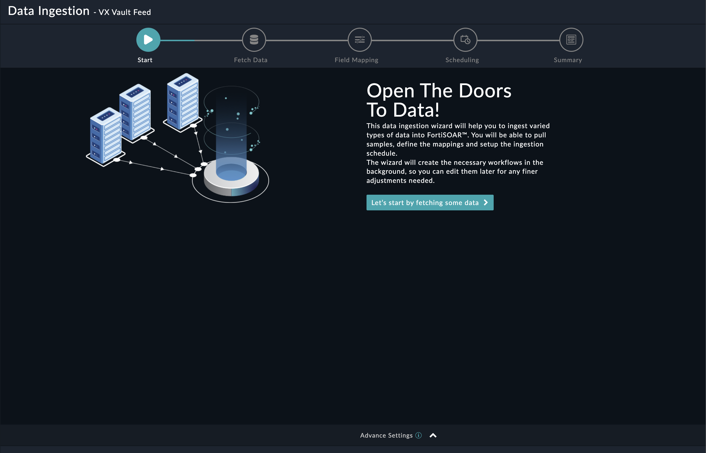
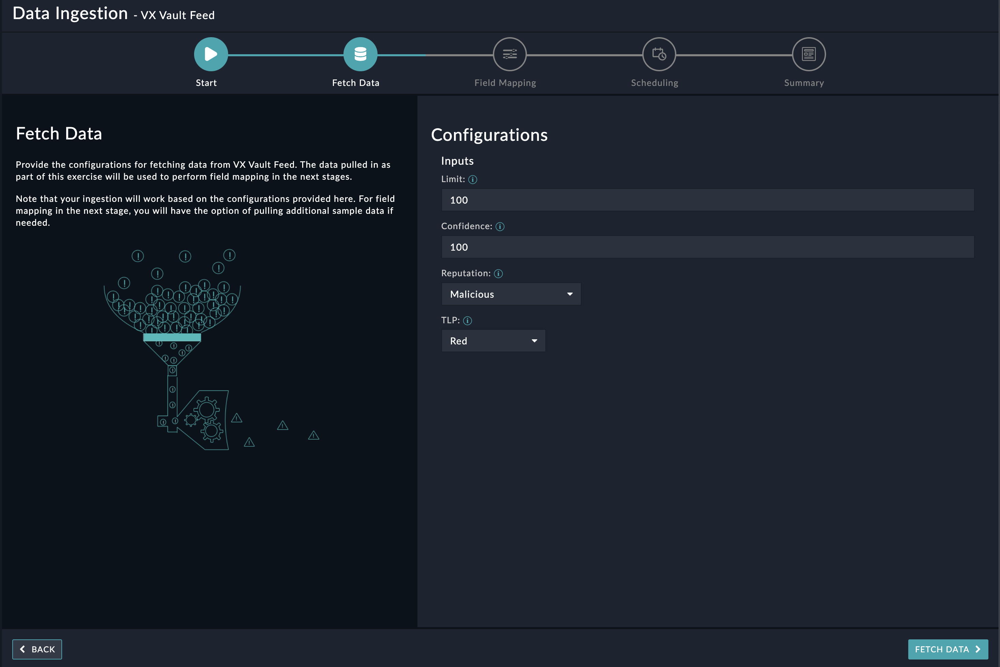
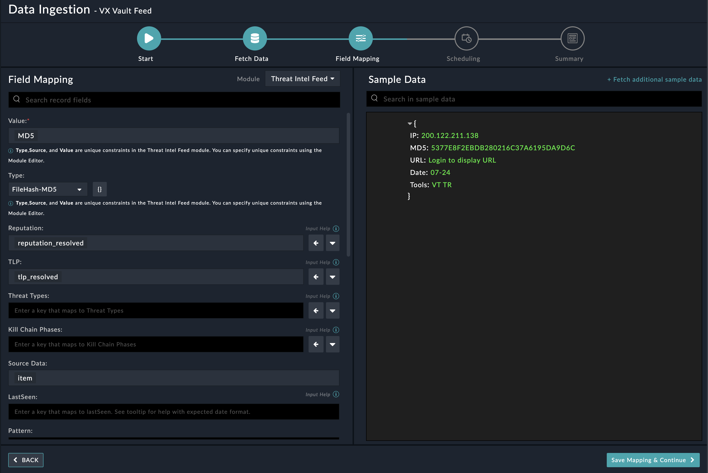
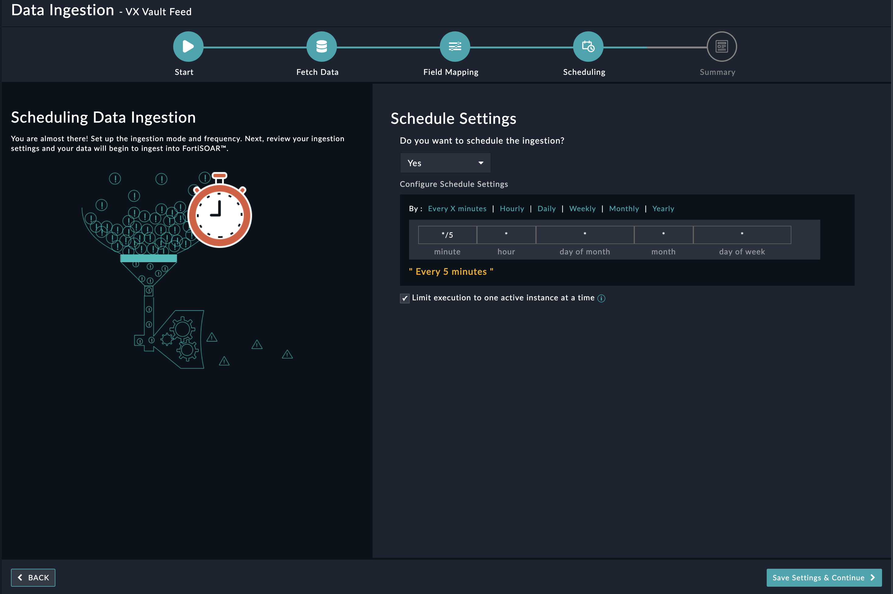

## About the connector
VX Vault is a platform that serves as a repository for malware samples and related research. This connector facilitates automated operations related to fetching the list indicators.   This connector has a dependency on the <a href="/content-hub/all-content/?contentType=solutionpack&amp;tag=ThreatIntelManagement" target="_blank" rel="noopener">Threat Intel Management Solution Pack</a>. Install the Solution Pack before enabling ingestion of Threat Feeds from this source.

This document provides information about the VX Vault Feed Connector, which facilitates automated interactions, with a VX Vault Feed server using FortiSOAR&trade; playbooks. Add the VX Vault Feed Connector as a step in FortiSOAR&trade; playbooks and perform automated operations with VX Vault Feed.

### Version information

Connector Version: 1.0.0

FortiSOAR&trade; Version Tested on: 7.5.0-4015

Authored By: Fortinet

Certified: Yes

## Installing the connector

Use the <strong>Content Hub</strong> to install the connector. For the detailed procedure to install a connector, click <a href="https://docs.fortinet.com/document/fortisoar/0.0.0/installing-a-connector/1/installing-a-connector" target="_top">here</a>.

You can also use the <code>yum</code> command as a root user to install the connector:

<pre>yum install cyops-connector-vx-vault-feed</pre>

## Prerequisites to configuring the connector
- You must have the credentials of VX Vault Feed server to which you will connect and perform automated operations.
- The FortiSOAR&trade; server should have outbound connectivity to port 443 on the VX Vault Feed server.

## Minimum Permissions Required
- Not applicable

## Configuring the connector
For the procedure to configure a connector, click [here](https://docs.fortinet.com/document/fortisoar/0.0.0/configuring-a-connector/1/configuring-a-connector)
### Configuration parameters

In FortiSOAR&trade;, on the Connectors page, click the <strong>VX Vault Feed</strong> connector row (if you are in the <strong>Grid</strong> view on the Connectors page) and in the <strong>Configurations</strong> tab enter the required configuration details:

<table border=1><thead><tr><th>Parameter</th><th>Description</th></tr></thead><tbody><tr><td>Server URL</td><td>Specify the URL of the VX Vault server to connect and perform automated operations.
</td>
</tr><tr><td>Verify SSL</td><td>Specifies whether the SSL certificate for the server is to be verified or not.  By default, this option is set to True.</td></tr>
</tbody></table>

## Actions supported by the connector
The following automated operations can be included in playbooks and you can also use the annotations to access operations from FortiSOAR&trade; release 4.10.0 and onwards:
<table border=1><thead><tr><th>Function</th><th>Description</th><th>Annotation and Category</th></tr></thead><tbody><tr><td>Get Indicators</td><td>Retrieves a list of all indicators from VX Vault Feed.</td><td>get_indicators  Investigation</td></tr>
</tbody></table>

### operation: Get Indicators
#### Input parameters
<table border=1><thead><tr><th>Parameter</th><th>Description</th></tr></thead><tbody><tr><td>Process Response As</td><td>Select the method of returning the Feed Data information. You can choose from following options:   Create as Feed Records in FortiSOAR: Specify the IRI of the Record Creation Playbook in Record Creation Playbook IRI field.   Return as a JSON: Select this option to receive feeds as a JSON object.
 <strong>If you choose 'Create as Feed Records in FortiSOAR'</strong><ul><li>Record Creation Playbook IRI: Specify the IRI of the playbook that creates feed records in FortiSOAR™ in the Record Creation Playbook IRI field.</li><li>Confidence: Specify the confidence score to be set for the feeds. Specify the range between 0 to 100. By default, this option is set to 90.</li><li>Reputation: Select the reputation to be set for the feeds. You can choose from the following options:  
Good, Suspicious, Malicious, No Reputation Available, TBD. By default, this option is set to "Good"</li><li>TLP: Select the TLP to be set for the feeds. You can choose from the following options:  
Red, Amber, Green, White. By default, this option is set to "White"</li></ul></td></tr><tr><td>Limit</td><td>Specify the maximum count of records that you want this operation to fetch from VX Vault server. By default, this option is set to 100.
</td></tr></tbody></table>

#### Output
The output contains the following populated JSON schema:

<pre>[
    {
        "IP": "",
        "MD5": "",
        "URL": "",
        "Date": "",
        "Tools": ""
    }
]</pre>
## Included playbooks
The `Sample - VX Vault Feed - 1.0.0` playbook collection comes bundled with the VX Vault Feed connector. These playbooks contain steps using which you can perform all supported actions. You can see bundled playbooks in the **Automation** > **Playbooks** section in FortiSOAR&trade; after importing the VX Vault Feed connector.

- VX Vault Feed > Create
- Get Indicators
- VX Vault Feed > Ingest > Fetch

**Note**: If you are planning to use any of the sample playbooks in your environment, ensure that you clone those playbooks and move them to a different collection since the sample playbook collection gets deleted during connector upgrade and delete.

## Data Ingestion Support

Use the Data Ingestion Wizard to easily ingest data into FortiSOAR™ by pulling data from VX Vault Feed. Currently, data from VX Vault Feed are mapped to "Threat Intel Feeds" in FortiSOAR™. For more information on the Data Ingestion Wizard, see the "Connectors Guide" in the FortiSOAR™ product documentation.

### Prerequisites

Before you begin ingesting data into FortiSOAR, it is strongly recommended that you deploy and set up the Threat Intel Management Solution Pack, since, by default, data ingestion is mapped to the Threat Intel Feed modules.

### Configure Data Ingestion

You can configure data ingestion using the “Data Ingestion Wizard” to seamlessly map the incoming VX Vault Feed data to FortiSOAR™ "threat intel feeds". 

The Data Ingestion Wizard enables you to configure the scheduled pulling of data from the VX Vault Feed into FortiSOAR™. It also lets you pull some sample data from VX Vault Feed using which you can define the mapping of data between the VX Vault Feed and FortiSOAR™. The mapping of common fields is generally already done by the Data Ingestion Wizard; users are mostly required to only map any custom fields that are added to the VX Vault Feed.

1.  To begin configuring data ingestion, click Configure Data Ingestion on the VX Vault Feed connector’s "Configurations" page.
Click Let’s Start by fetching some data, to open the “Fetch Sample Data” screen.

Sample data is required to create a field mapping between the VX Vault Feeds and FortiSOAR™. The sample data is pulled from connector actions or ingestion playbooks.

2.  On the Fetch Data screen, provide the configurations required to fetch VX Vault Feeds. You can pull data from VX Vault Feed and add custom confidence level, reputation, and TLP to that feed. 

The fetched data is used to create a mapping between the VX Vault Feeds and FortiSOAR™ threat intel feeds. Once you have completed specifying the configurations, click Fetch Data.

3.  On the Field Mapping screen, map the fields of a VX Vault Feed to the fields of a threat intel feed present in FortiSOAR™.
To map a field, click the key in the sample data to add the “jinja” value of the field. For example, to map the MD5 parameter of a VX Vault Feed to the value parameter of a FortiSOAR™ threat intel feed, click the value field, and then click the MD5 field to populate its keys: 

For more information on field mapping, see the Data Ingestion chapter in the "Connectors Guide" in the FortiSOAR™ product documentation. Once you have completed mapping the fields, click Save Mapping & Continue.

4.  Use the Scheduling screen to configure schedule-based ingestion, i.e., specify the polling frequency to VX Vault Feed, so that the content gets pulled from the VX Vault Feed integration into FortiSOAR™.
On the Scheduling screen, from the Do you want to schedule the ingestion? drop-down list, select Yes.
In the “Configure Schedule Settings” section, specify the Cron expression for the schedule. For example, if you want to pull data from VX Vault Feed every morning at 5 am, click Daily, and in the hour box enter 5 , and in the minute box enter 0:

Once you have completed scheduling, click Save Settings & Continue.

5.  The Summary screen displays a summary of the mapping done, and it also contains links to the Ingestion playbooks. Click Done to complete the data ingestion, and exit the Data Ingestion Wizard.